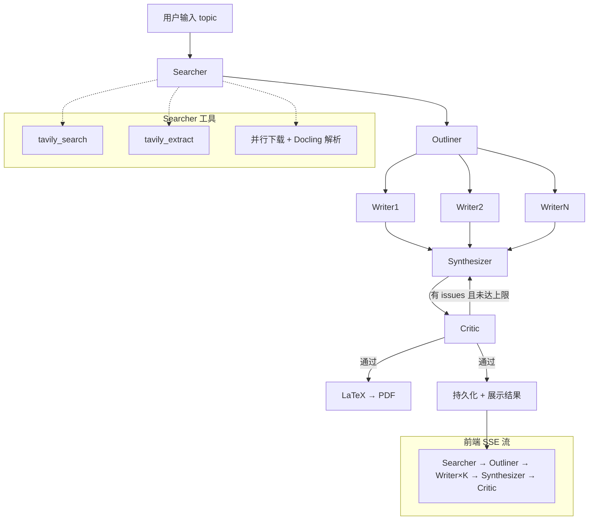

# AI Researcher

基于 LangGraph 多 Agent 流水线的科研文献综述生成器。目标用户是想系统入门某个 CS 领域的开发者，场景定位为入门型综述（10-30 篇经典论文），而非前沿追踪。

## 架构图



## 目录结构

```
ai-researcher/
├── api.py                  # FastAPI + SSE 流式端点
├── db.py                   # SQLAlchemy ORM + SQLite
├── latex.py                # Markdown → LaTeX → PDF
├── main.py                 # 命令行入口（非 Web）
├── agents/
│   ├── __init__.py
│   ├── shared.py           # make_llm() 共享工厂
│   ├── state.py            # LangGraph State 定义
│   ├── graph.py            # LangGraph 图编排
│   ├── searcher.py         # Searcher Agent（ReAct + tool calling）
│   ├── outliner.py         # Outliner Agent（LLM 聚类章节）
│   ├── writer.py           # Writer Agent（并行，Send API）
│   ├── synthesizer.py      # Synthesizer Agent（组装初稿 + References）
│   └── critic.py           # Critic Agent（审稿 + 退修循环）
├── tools/
│   ├── __init__.py         # 进度回调共享状态 + 重导出
│   ├── search.py           # Tavily Search / Extract
│   └── pdf.py              # PDF 并行下载 + Docling 解析
├── static/
│   └── index.html          # SPA 前端（SSE → 实时卡片渲染）
├── tests/
│   └── test_api.py         # 6 个 pytest（mock agent + TestClient）
├── output/                 # 生成的 .tex / .pdf（运行时产物）
├── surveys.db              # SQLite 数据库（运行时产物）
├── .env / .env.example     # API Key 配置
├── pyproject.toml          # 依赖声明（uv 管理）
└── README.md
```

---

## 1. 搜索与爬虫工具

`tools/search.py` — Searcher Agent 的 ReAct 工具函数。

### Tavily Search

```python
tavily_search(query: str, max_results: int = 5) -> str
```

- 调用 Tavily Search API（`search_depth="advanced"`）
- 每次调用前通过 `_report("tool_start", ...)` 推送 SSE 事件（query 内容）
- 返回结果后推送 `_report("tool_result", ...)`（包含每条结果的标题和 URL 摘要）
- 返回值是 `"Title: ...\nURL: ...\nContent: ..."` 拼接字符串，供 LLM 阅读理解

### Tavily Extract

```python
tavily_extract(url: str) -> str
```

- 提取指定 URL 的完整页面内容（`raw_content`）
- 同样推送 `tool_start` / `tool_result` SSE 事件
- 返回值是页面的纯文本全文

### 进度回调机制

`tools/__init__.py` 维护模块级 `_progress_reporter` 变量，提供 `set_progress_reporter(fn)` 注册回调。所有工具函数通过 `_report(type, **data)` 向回调推送事件。`api.py` 在 SSE 流开始时注入 `lambda evt: progress_q.put(evt)`，将事件从同步工具代码桥接到异步事件循环。

---

## 2. PDF 下载与解析

`tools/pdf.py` — 由 Searcher Agent 在 LLM 阶段结束后调用，不属于 tool calling。

### 流程

```
LLM 输出论文列表 + PDF URL → batch_download_and_parse(urls)
                                    │
                     ┌──────────────┴──────────────┐
                     │  阶段一：并行下载（4 线程）    │
                     │  _download_single × N        │
                     │  - urllib.request.urlretrieve│
                     │  - PDF 魔数校验（%PDF）        │
                     │  - SSE: pdf_start /          │
                     │    pdf_download_progress      │
                     └──────────────┬──────────────┘
                                    │
                     ┌──────────────┴──────────────┐
                     │  阶段二：Docling 批量解析     │
                     │  DocumentConverter           │
                     │  .convert_all(paths)         │
                     │  - MPS 加速（Apple Silicon）  │
                     │  - OCR 关闭（纯文本提取）      │
                     │  - SSE: pdf_parse_progress   │
                     │    → pdf_done                │
                     └──────────────┬──────────────┘
                                    │
                         返回 [{markdown, source_type}]
```

### 设计要点

- 下载和解析两阶段分离：下载失败不影响其他论文，解析失败降级为 `source_type: "none"`
- 每篇论文的 markdown 通过 `convert_all` 批量处理，比逐篇 `convert` 快（共享模型加载）
- 下载到 `/tmp/searcher_papers/`，不污染项目目录
- `_download_single` 在独立线程中运行，通过 `concurrent.futures` 管理

---

## 3. 多智能体编排

`agents/graph.py` — LangGraph StateGraph 定义。

### State 定义（`agents/state.py`）

```python
class State(TypedDict):
    topic: str                                       # 用户输入
    papers: list[dict]                               # Searcher 产出
    outline: list[OutlineSection]                    # Outliner 产出
    current_section_index: int                       # Writer 扇出索引
    chapters: Annotated[list[str], operator.add]     # Writer×K 产出（累加合并）
    draft: str                                       # Synthesizer 产出
    issues: list[str]                                # Critic 产出
    retry_count: int                                 # 重试计数
```

`chapters` 使用 `operator.add` reducer，多个 Writer 并行返回时自动拼接。

### 节点与边

```
START → searcher → outliner → [writer × K] → synthesizer → critic ⇄ synthesizer → END
```

| Agent | 运行方式 | 输入 | 输出 |
|---|---|---|---|
| Searcher | 串行 | topic | papers |
| Outliner | 串行 | papers（标题+摘要前 1500 字） | outline（章节划分 + 论文分配） |
| Writer | 并行（Send API） | outline[i] + papers | chapters[i]（每章正文） |
| Synthesizer | 串行（可重入） | chapters + outline | draft（完整综述 + References） |
| Critic | 串行 | draft + papers | issues（空列表 = 通过） |

### Writer 并行扇出

```python
def _fanout_writers(state):
    return [Send("writer", {"current_section_index": i, ...}) for i in range(len(outline))]
```

每个 Writer 实例只拿到自己章节的 `current_section_index`，互不干扰。`chapters` 通过 `operator.add` 自动合并。

### Synthesizer ⇄ Critic 博弈

```
synthesizer → critic → 有 issues 且 retry < 3 → synthesizer（修订）
                     → 无 issues 或 retry >= 3 → END
```

Critic 审稿发现硬检查问题（引用越界、遗漏论文）或软检查问题（逻辑不连贯、缺乏比较分析）时，Synthesizer 通过 `RETRY_PROMPT` 针对性修改。

### 模型配置

`agents/shared.py` 提供 `make_llm(streaming=False)`，所有 Agent 统一调用。模型名、base_url、api_key 从 `.env` 读取，支持所有 OpenAI 兼容接口。Searcher 需要 `streaming=True`（ReAct tool calling 需要流式），其余 Agent 默认非流式。

---

## 4. FastAPI 与 SSE 流式设计

### 端点

| 方法 | 路径 | 说明 |
|---|---|---|
| GET | `/api/surveys/stream?topic=...` | 核心 SSE 流式生成 |
| GET | `/api/surveys` | 历史列表 |
| GET | `/api/surveys/{id}` | 单篇详情（含 papers/sections/chapters） |
| GET | `/api/surveys/{id}/pdf` | PDF 下载 |
| `/*` | — | `StaticFiles` 挂载 SPA 前端 |

### SSE 事件流架构

核心挑战：LangGraph 的 `astream_events`（异步）和工具代码的进度回调（同步阻塞）需要合并为一路 SSE。

```
                    ┌──────────────────┐
                    │   event_q          │
                    │  (asyncio.Queue)   │
                    └──────┬───────────┘
              ┌────────────┴────────────┐
              │                         │
     graph_producer()           progress_producer()
     (async task)               (async task, 0.3s 轮询)
              │                         │
   graph.astream_events()      progress_q (queue.Queue)
   (LangGraph 事件)                   │
                              _report() → set_progress_reporter()
```

单消费者主循环：从 `event_q` 取事件，按 `source` 分发：
- `"graph"` → 解析 `astream_events` v2 原始事件，提取 agent_start / token / thinking / agent_done
- `"progress"` → 透传为 tool_start / tool_result / pdf_start / pdf_done
- `"graph_eof"` → 排空残留 progress 事件 → 持久化 → 生成 PDF → 发送 done

### SSE 事件类型

| type | 触发时机 | 携带字段 |
|---|---|---|
| `agent_start` | Agent 节点开始 | agent, writer_index, paper_titles, chapter_titles 等 |
| `token` | LLM 流式输出 | agent, content |
| `thinking` | DeepSeek 思考过程 | agent, content |
| `tool_start` | 工具调用开始 | tool, query/url |
| `tool_result` | 工具调用结束 | tool, summary, items |
| `pdf_start` | PDF 下载开始 | total |
| `pdf_done` | PDF 解析完成 | results |
| `outline` | Outliner 完成 | sections |
| `agent_done` | Agent 节点结束 | agent, papers/issues 等 |
| `done` | 全部完成 | survey_id, has_pdf |
| `error` | 异常 | message |

### Writer 事件路由

`api.py` 维护 `writer_node_runs`（run_id → writer_index）和 `chat_to_writer`（chat_model_run_id → parent_chain_run_id）。`on_chat_model_start` 事件建立父子 run 的映射，`on_chat_model_stream` 事件通过映射路由到正确的 Writer 卡片。

---

## 5. SQLite 持久化

`db.py` — SQLAlchemy 2.0 ORM + SQLite，数据库文件 `surveys.db`。

### 数据模型

```
surveys
  ├── 1:N → papers    (论文：标题、作者、年份、markdown、来源类型)
  ├── 1:N → sections  (大纲章节：标题、主题、分配的论文 ID)
  └── 1:N → chapters  (各章正文：标题、内容)
```

### 持久化策略

- **管道开始时**：`create_survey(topic)` → status="running"，立即返回 survey_id
- **管道结束时**：`update_survey_done(id, state)` → 一次性批量写入 papers + sections + chapters + draft，更新 status="done"
- **中间步骤不持久化**：流式 token 和工具调用仅通过 SSE 推送前端，不落库

### API 查询

- `list_surveys()` — 时间降序，topic + draft 前 200 字预览
- `get_survey(id)` — draft 全文 + papers + sections + chapters，用于历史回放

---

## 6. 前端设计

`static/index.html` — 纯静态 SPA，EventSource API 连接 SSE，无框架。

### 视觉

- 背景 `#FAFAF9`（暖白），卡片 `#FFFFFF`，强调 `#B5834A`（暖金）
- 展示字体 Crimson Pro（标题、Agent 标签），正文 Inter
- 侧边栏 220px 固定 + 主内容区 `flex: 1` 自适应

### 布局

```
┌──────────┬─────────────────────────────────┐
│ Sidebar  │  Hero + 输入框                   │
│ 220px    ├─────────────────────────────────┤
│          │  Pipeline 卡片（纵向排列）        │
│ History  │  ┌ Searcher ──────────────────┐ │
│          │  │ activity-stream（工具+思考） │ │
│          │  │ pdf-progress               │ │
│          │  │ 论文列表                     │ │
│          │  └────────────────────────────┘ │
│          │  ┌ Outliner ──────────────────┐ │
│          │  │ 论文输入摘要 + 大纲输出       │ │
│          │  └────────────────────────────┘ │
│          │  ┌─ writers-row (grid) ───────┐ │
│          │  │ Writer1 │ Writer2 │ ...    │ │
│          │  └────────────────────────────┘ │
│          │  ┌ Synthesizer ───────────────┐ │
│          │  │ 章输入摘要 + 流式全文         │ │
│          │  └────────────────────────────┘ │
│          │  ┌ Critic ────────────────────┐ │
│          │  │ issues / Passed            │ │
│          │  └────────────────────────────┘ │
│          ├─────────────────────────────────┤
│          │  Result（Markdown 渲染 + PDF 按钮）│
└──────────┴─────────────────────────────────┘
```

### 关键机制

- **Searcher 活动流**：`.activity-stream` 统一展示工具调用和思考过程，按 SSE 到达顺序追加（`appendActivityThinking` / `addActivityTool`）。旧的 `.thinking-box` 和 `.tool-log` 对 Searcher 禁用
- **Writer 并行卡片**：`writers-row` 使用 CSS Grid，`auto-fit + minmax(180px, 1fr)` 自适应列数
- **PDF 进度**：`pdf_start` 显示"开始下载并解析 PDF…"，`pdf_done` 显示完成统计，不在 agent_done 后隐藏
- **历史回放**：`replaySurvey(survey)` 根据 papers/sections/chapters 数据重建所有卡片（均为 done 状态）+ Result 区
- **滚动**：`body { height: 100vh; overflow: hidden }` + `main { min-height: 0; overflow-y: auto }`，主内容区独立滚动

---

## 7. Markdown → LaTeX → PDF

`latex.py` — Synthesizer 产出的 Markdown 综述通过 LaTeX 编译为 PDF。

### 技术选型

- **LaTeX 引擎**：Tectonic（Rust 实现，单二进制，按需下载宏包）
- **文档类**：`ctexart`（内置中文支持，无需配置字体）
- **页边距**：2.5cm（`geometry` 宏包）

Tectonic 在 PyPI 上为空包，通过系统包管理器安装（`brew install tectonic`）。未安装时 PDF 生成静默失败，综述正常输出，仅下载按钮不显示。

### 流程

```
Synthesizer 输出的 Markdown
        │
        ▼
    md2tex() 逐行转换
        │
        ▼
    LaTeX body（转义 + 格式化）
        │
        ▼
  填入 LATEX_TEMPLATE → 写入 output/survey_{id}.tex
        │
        ▼
  tectonic -X compile → output/survey_{id}.pdf
        │
        ▼
  GET /api/surveys/{id}/pdf → FileResponse
```

### md2tex 转换规则

| Markdown | LaTeX |
|---|---|
| `# / ## / ###` | `\section* / \subsection* / \subsubsection*` |
| `**bold**` / `*italic*` | `\textbf{}` / `\textit{}` |
| `## References` 后的 `[N] ...` | `\begin{enumerate}[label={[\arabic*]}]` + `\item` |

特殊字符（`\&%$#_{}~^`）全部转义。`[N]` 引用标记在转义前保存为占位符，完成后恢复，避免 `[1]` 中的方括号被误处理。

### 调用

`api.py` 管道末尾通过 `asyncio.to_thread` 在线程池中执行，60 秒超时。失败不影响 done 事件（`has_pdf: false`）。

---

## 开发准则

- 在对文件做任何修改前，先说明要改什么，等用户确认后再执行
- 最小化改动：只改和请求相关的代码，不顺手改相邻代码或格式
- 不引入抽象层、配置项、错误处理，除非明确要求
- 测试阶段 Searcher 限制 3 篇论文以节省 Tavily API
