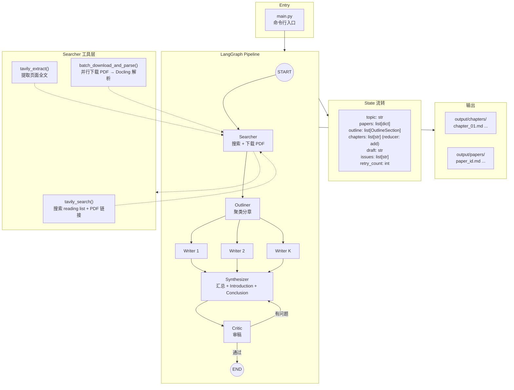
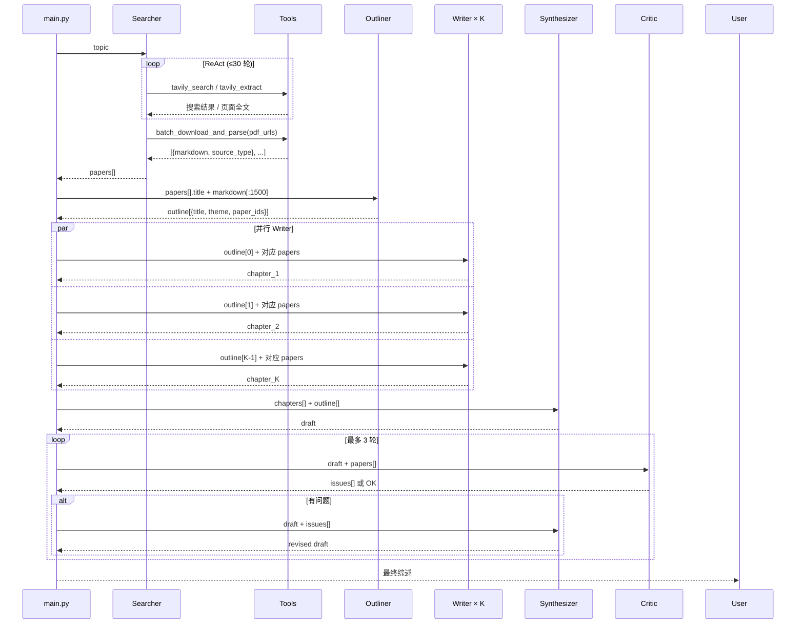
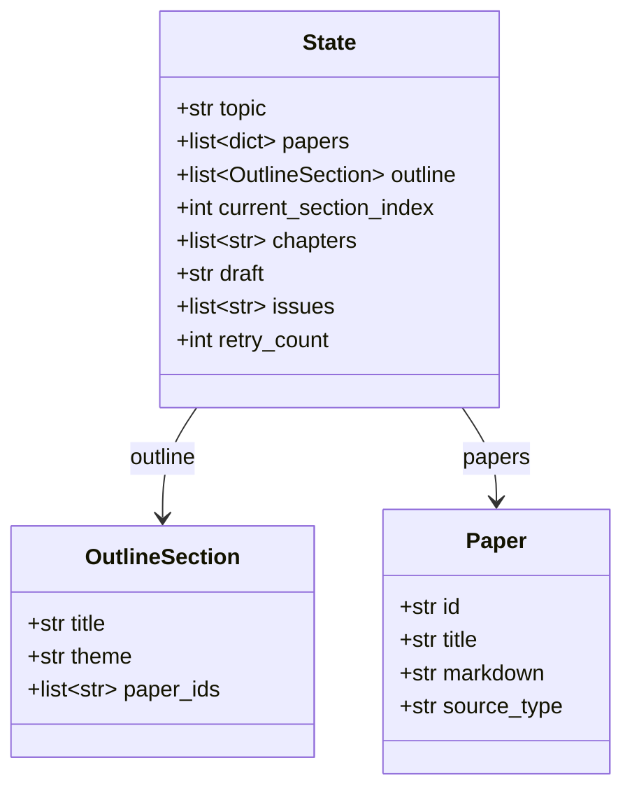
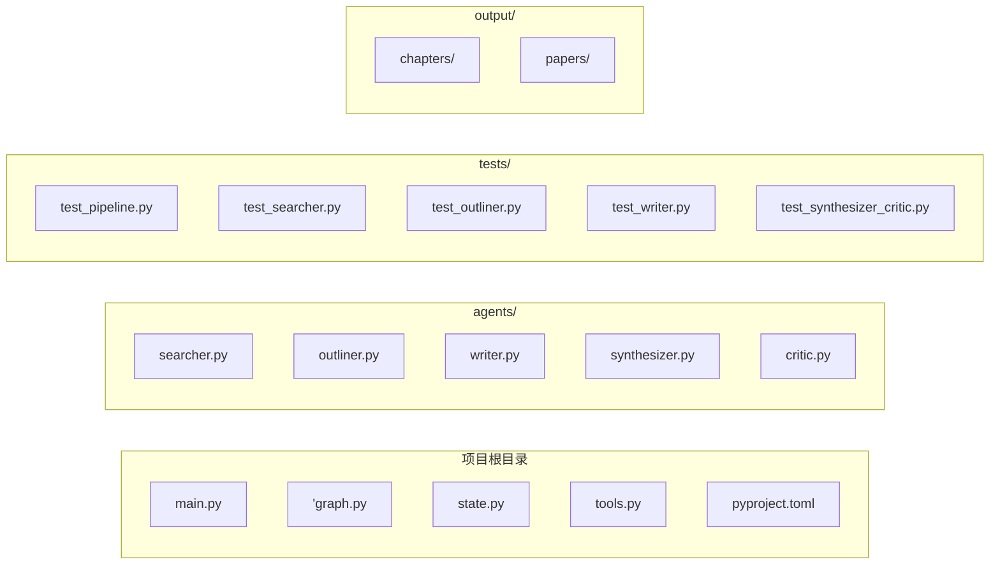

# 项目架构

## 整体架构

```mermaid
graph TB
    subgraph Entry
        CLI["main.py<br/>命令行入口"]
    end

    subgraph Graph["LangGraph Pipeline"]
        direction LR
        START((START)) --> S["Searcher<br/>搜索 + 下载 PDF"]
        S --> O["Outliner<br/>聚类分章"]
        O --> W1["Writer 1"]
        O --> W2["Writer 2"]
        O --> WN["Writer K"]
        W1 --> SYNTH["Synthesizer<br/>汇总 + Introduction + Conclusion"]
        W2 --> SYNTH
        WN --> SYNTH
        SYNTH --> C["Critic<br/>审稿"]
        C -- 有问题 --> SYNTH
        C -- 通过 --> ENDN((END))
    end

    subgraph Tools["Searcher 工具层"]
        TS["tavily_search()<br/>搜索 reading list + PDF 链接"]
        TE["tavily_extract()<br/>提取页面全文"]
        BD["batch_download_and_parse()<br/>并行下载 PDF → Docling 解析"]
    end

    subgraph State["State 流转"]
        ST["topic: str<br/>papers: list[dict]<br/>outline: list[OutlineSection]<br/>chapters: list[str] (reducer: add)<br/>draft: str<br/>issues: list[str]<br/>retry_count: int"]
    end

    subgraph Output["输出"]
        CH["output/chapters/<br/>chapter_01.md ..."]
        PA["output/papers/<br/>paper_id.md ..."]
    end

    CLI --> Graph
    S -.-> Tools
    TS -.-> S
    TE -.-> S
    BD -.-> S
    Graph --> State
    Graph --> Output
```

## Pipeline 数据流

```mermaid
sequenceDiagram
    participant CLI as main.py
    participant S as Searcher
    participant T as Tools
    participant O as Outliner
    participant W as Writer × K
    participant SYN as Synthesizer
    participant C as Critic

    CLI->>S: topic
    loop ReAct (≤30 轮)
        S->>T: tavily_search / tavily_extract
        T-->>S: 搜索结果 / 页面全文
    end
    S->>T: batch_download_and_parse(pdf_urls)
    T-->>S: [{markdown, source_type}, ...]
    S-->>CLI: papers[]

    CLI->>O: papers[].title + markdown[:1500]
    O-->>CLI: outline[{title, theme, paper_ids}]

    par 并行 Writer
        CLI->>W: outline[0] + 对应 papers
        W-->>CLI: chapter_1
    and
        CLI->>W: outline[1] + 对应 papers
        W-->>CLI: chapter_2
    and
        CLI->>W: outline[K-1] + 对应 papers
        W-->>CLI: chapter_K
    end

    CLI->>SYN: chapters[] + outline[]
    SYN-->>CLI: draft

    loop 最多 3 轮
        CLI->>C: draft + papers[]
        C-->>CLI: issues[] 或 OK
        alt 有问题
            CLI->>SYN: draft + issues[]
            SYN-->>CLI: revised draft
        end
    end

    CLI-->>User: 最终综述
```

## State 结构

```mermaid
classDiagram
    class State {
        +str topic
        +list~dict~ papers
        +list~OutlineSection~ outline
        +int current_section_index
        +list~str~ chapters
        +str draft
        +list~str~ issues
        +int retry_count
    }

    class OutlineSection {
        +str title
        +str theme
        +list~str~ paper_ids
    }

    class Paper {
        +str id
        +str title
        +str markdown
        +str source_type
    }

    State --> OutlineSection : outline
    State --> Paper : papers
```

## 项目文件树

```mermaid
graph LR
    subgraph 项目根目录
        main.py
        'graph.py
        state.py
        tools.py
        pyproject.toml
    end

    subgraph agents/
        searcher.py
        outliner.py
        writer.py
        synthesizer.py
        critic.py
    end

    subgraph tests/
        test_pipeline.py
        test_searcher.py
        test_outliner.py
        test_writer.py
        test_synthesizer_critic.py
    end

    subgraph output/
        chapters/
        papers/
    end
```
