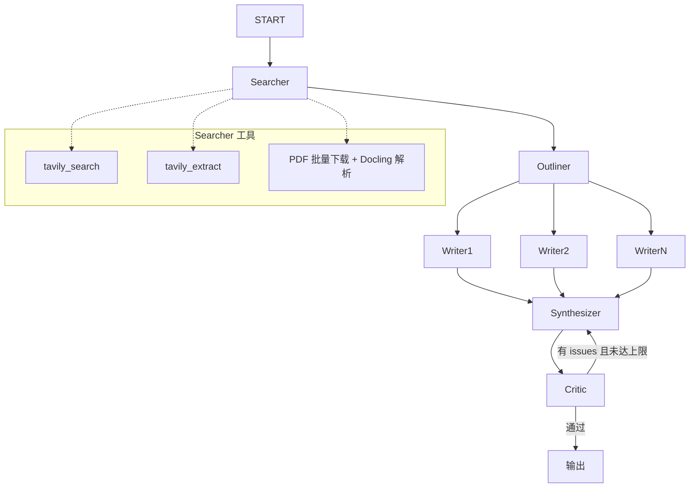

课设 - 面向初学者的科研文献综述助手

> 花两天时间应付学校的智能体课设，选题为科研文献综述助手。

#### 需求分析

在互联网上进行调研，无论是工程项目还是学术论文，都是以研究员为目标用户：获取某个方向的大量前沿论文，进行综述撰写。

自己并非研究员，因此自己设想的目标用户为入门某个领域的初学者，通过几篇经典论文掌握该领域的历史发展脉络。AI 搜集的应当为高质量的经典论文，而非高数量的领域前沿论文。

#### 系统架构

系统架构层面有两个重点，一是如何获取经典论文，二是多智能体如何编排，生成更高质量的综述。

**如何获取经典论文？**

参考网上找到的面向研究员的综述助手项目，自己一开始尝试从 Semantic Scholar 中获取高引用、高影响力论文，从 arXiv 中获取 LaTeX 源文件。

但是由于自己需求的不同，很快就遇到了几个问题：

1. Semantic Scholar 高引用论文无法作为参考。以 distributed system 为关键词、引用量由高到低排序、计算机科学领域进行搜索，排行靠前的会有一些无关的算法和机器学习领域的内容。
2. arXiv 是预印本论文平台，很多经典论文压根不会发表在上面。

因此自己的最终做法是：

1. 通过搜索和爬虫工具，获取互联网上人工整理好的论文阅读列表，AI 根据需求抉择最终选择哪些论文。
2. 通过搜索工具获取经典论文的 PDF 链接，下载解析为 Markdown 格式。

**多智能体如何编排以生成更高质量的综述？**

自己之前机缘巧合在 LangChain Academy 里接触过 STORM 论文：如何通过多智能协作编写 Wiki 长文。

以此为线索，找到了 AutoSurvey 系列论文。因此自己的多智能体编排基于 AutoSurvey 实现（原始论文集 -> 聚类 -> 大纲 -> 撰写 -> 整合 -> 评估），并根据项目需求做了适当简化。

自己编排的智能体协作流程：

- Searcher 在上文已经介绍过，不在赘述。
- Outliner 阅读所有论文的前 1500 字，目的是阅读所有论文的摘要。随后根据这些信息撰写综述大纲，每个章节对应的论文集，分配给多个 Writer。
- Writer 阅读分配给自己的所有论文全文，撰写自己负责的章节。
- Synthesizer 根据 Writer 的输出，组织全文。
- Critic 对文章进行审查，如果存在问题，返工给 Synthesizer 重新生成。

源码中还有更详细的提示词，是 AI 生成，自己 debug 后的结果。

**架构图**

以上内容就是该程序的核心了。

#### 工程实现

这部分都是 AI 代劳，包括上述思考的具体实现，前端、FastAPI、SQLite、Markdown 转 LaTeX 转 PDF 的设计与具体实现。

#### Vibe Coding 反思

1. **增量验证**：如果用到了自己不熟悉的外部依赖，每实现一个小功能，就应当让 AI 进行验证。
2. **根据版本查询 API 用法**：对于自己不熟悉的工具，问题经常出在 AI 用的是工具新版 API，但 AI 的记忆仍是旧版用法。比如本项目用到的 Docling，解析 PDF 的 API 变动，Debug 很久才找到问题所在。

#### 未来优化

AI 生成文献综述，幻觉问题不可忽视，质量评估在学界也有相关研究。

程序现在同步阻塞，完全不支持多用户并发使用。

听说 LangChain 团队推出的 LangSmith 可观测性框架是现在的主要营收，本程序目前的可观测性部分实现很简陋，就是终端打印日志，需要优化。

#### 项目反思

该选题的初衷确实是希望满足自己了解某个领域的需求，问题在于真的需要开发这样一个系统吗？

Claude Code 这类基于终端的 Coding Agent 就是一个完美的平台，甚至多智能体也被平台内置其中。自己只需把「针对该需求思考的流程和架构」沉淀为 Skill 接入任意一个基于终端的 Coding Agent，就能够满足自己的需求。

搭建一个这样的系统，优势是门槛低，更像是一个产品，但如果抛开课设需求，对自己真的有意义吗？结局大概率是作为一个 0 Star 的项目被遗忘在互联网的角落里。

